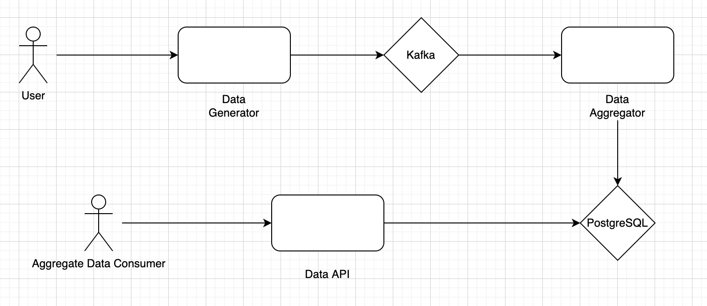

# Kafka Data Pipeline

## Architecture



## Run Application

1. To run application:

```
docker-compose up --build -d
```

This will start Kafka cluster with 1 zookeeper and start `data-generator` application that automatically creates the `stocks` kafka topic and sends the json message.

2. To Check if messages are being stored in the Kafka topic : 

```
docker-compose exec kafka bash
cd /opt/kafka
/bin/kafka-console-consumer.sh --from-beginning --bootstrap-server kafka:9092 --topic=stocks
```
